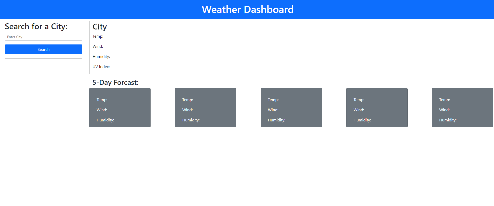
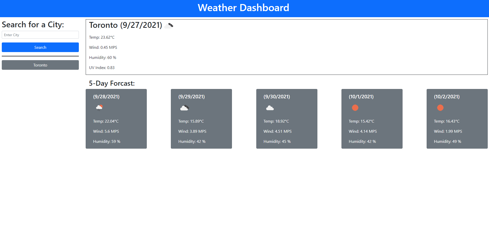
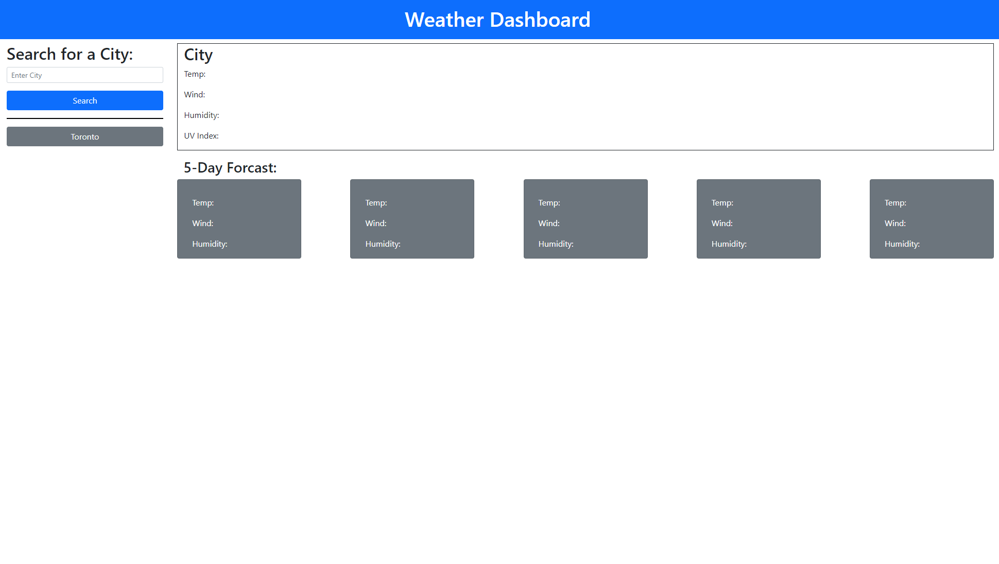

# 06 Weather-Dashboard
Create a weather app that uses a weather API to pull data for a user entered city. Then add the entries into a search history list and have that list be locally stored so when the page is refreshed the entries appear.

## process
* I created all the necessary files needed html, js, css
* I coded out the html and stylized the css to match the mock up
* Created the js script to make the API fetch calls
* flushed out the script to make everything match the mock up from the API call
* created the localStorage elements to store the user entered data and then return the data when page was re loaded
* added a clear search history button and made it function

## links
GitHub: https://github.com/ToiletTakos/weather-dashboard
Deployed URL: https://toilettakos.github.io/weather-dashboard/

## Screenshots

